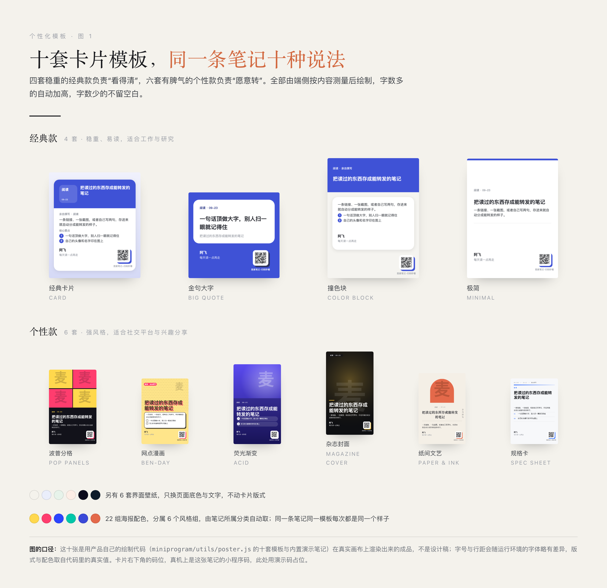
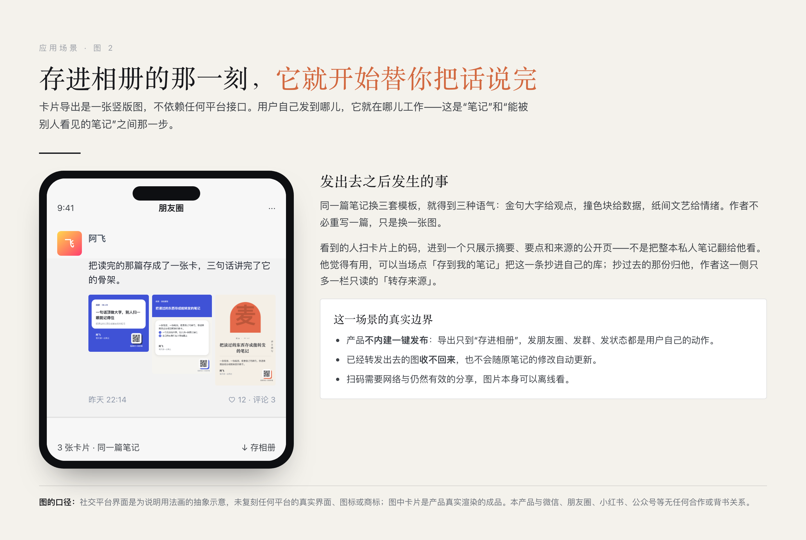
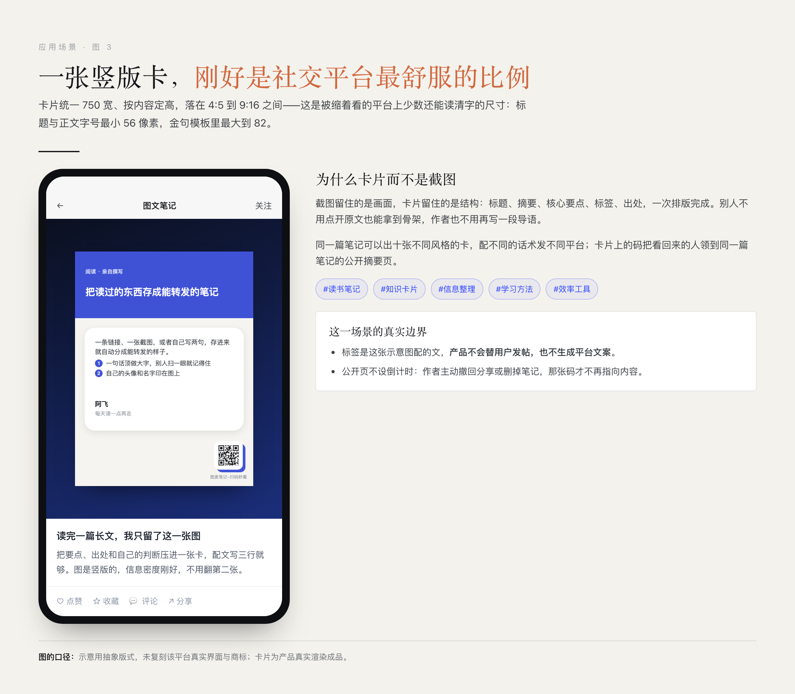
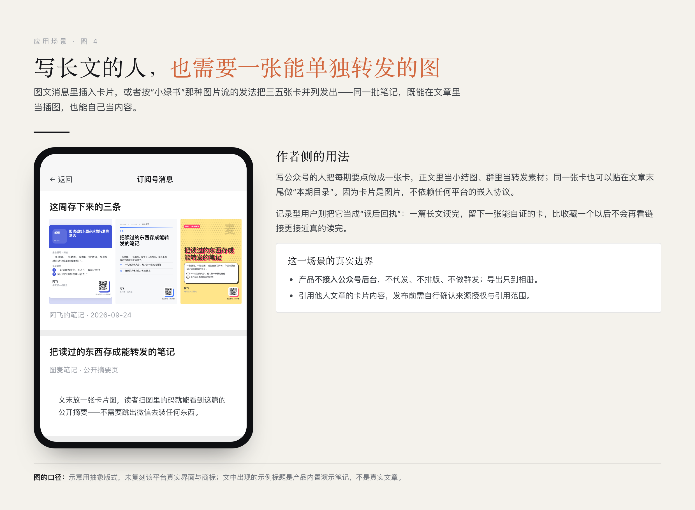
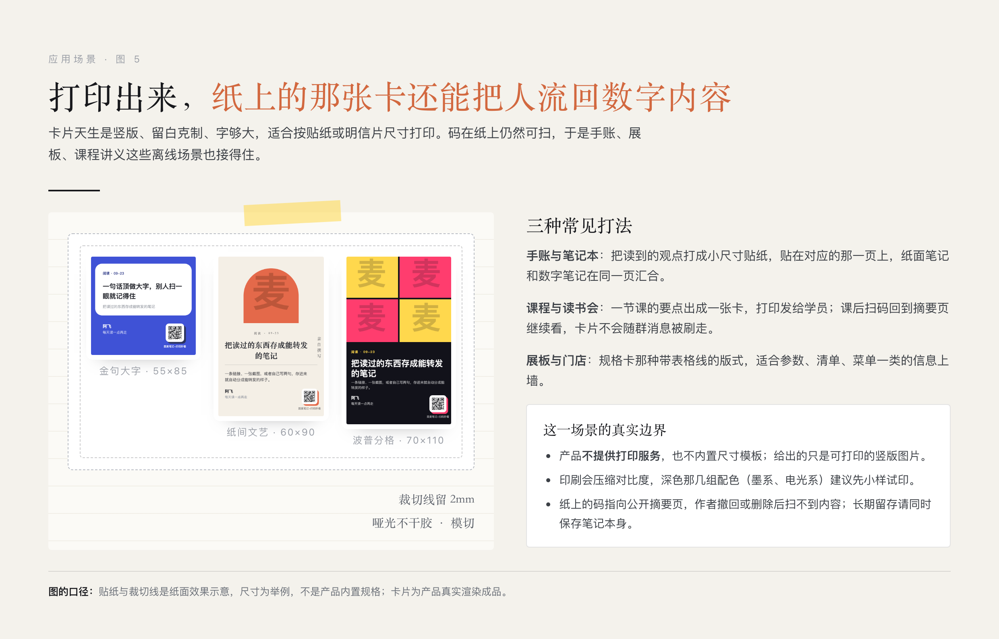
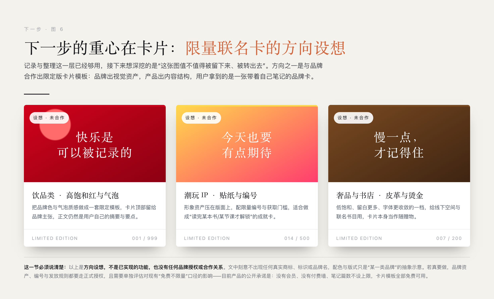

# 图麦笔记｜让有价值的信息，不止于收藏

**2026 微信小程序开发大赛 · 作品说明（产品版）**

> 一款把**链接、截图和手写**变成结构化知识笔记的微信小程序，并且把每条笔记画成**十种版式的卡片图**——卡片可以存进相册、发到社交平台、打印上墙，图上的小程序码再把看到的人领回这条笔记。
>
> 这份说明把产品放在最前面：第 2—6 节讲三件我们真正做了差异化的事（**录入方式、智能摘要、个性化卡片模板**）和卡片被用出去的场景；第 7—11 节把技术方案、平台能力、数据边界、交互方法与验证方式压缩收在后面，供评审需要核对时查。

---

## 一、要解决的问题：存下来了，但用不上

我做产品经理这些年，有价值的内容通常被存在三个地方：公众号文章进微信收藏，课程重点截进相册，行业资料散在群聊链接里。真要引用某条信息时，我记得“看过”，记不得“放在哪”；就算找到了，还得重新读一遍再摘录。

断点很具体：**收藏保存的是入口，不是内容**。图片保住了画面，但画面里的字检索不到；来源越多，重新使用时的寻找和摘录成本越高。而所有笔记应用的第一屏都是一块空白编辑器，它在要求用户先回答“你要写什么”——可碎片信息场景里，用户手里有的是**别人的内容**，不是一篇待写的文章。

所以这个产品要做的事压缩成一句话：**把“存下来”和“整理好”之间那次摘录、概括、打标签的重复劳动交给工具，把最终判断留给用户**；再把整理好的东西做成一张**能被别人看见、也能把人领回来**的卡片。

这个需求起点是我的个人经历，不是用户调研结论。有效性应当用任务完成率、整理耗时、搜索找回率来验证；本文不宣称提升了某个百分比，也不给出用户规模数字。

| 项目 | 说明 |
| --- | --- |
| 作品名称 / 形态 | 图麦笔记 / 微信原生小程序 |
| 开发主体 | 个人开发者；产品经理背景，独立承担产品与工程整合 |
| 核心用户 | 学习资料积累者、职场信息整理者、内容创作者、兴趣记录者 |
| 核心技术 | 原生小程序 + Python 服务 + 开源 OCR + 微信云开发 AI |
| 三条录入 | 公开链接 / 截图与拍照 / 手写 |
| 卡片出口 | 十套模板、六套壁纸、22 组海报配色，端侧绘制后存入相册 |
| 版本口径 | 本地代码标识 v1.4.0（`miniprogram/pages/about/about.js:9`）；这是代码里的标识，不等同于已发布版本证明 |
| 文档核对日期 | 2026 年 9 月 24 日 |

---

## 二、录入：把记录的起点从空白页前移

这是第一处创新。多数笔记工具把“开始记录”定义为“打开空白页开始写”，我们把它前移到**用户已经看到的那条内容**上。三个入口并列，各自走自己的技术路径，最后汇入同一套笔记结构。

**链接转笔记。** 粘贴一条公开网页地址，后端抓取正文、抽取主体内容，再交给模型提炼，保留来源地址与抓到的原文。边界要说清楚：登录页、付费墙、反爬站点或没有有效正文的页面会**直接提示失败**，它不是任意网站的通用解析器。

**截图与拍照转笔记。** 从相册或相机导入，一批最多 9 张，在自建服务器上完成文字识别，识别结果与链接抓到的正文共用同一条提炼链路。主要支持 JPG、PNG；识别质量受清晰度、版式、字号影响，不承诺所有截图都能读对。

**手写。** 直接保存用户自己的内容，不走抓取、OCR 或模型。这条入口是故意留着的：记录不该强迫所有输入都经过一次 AI，用户自己的判断要有地方直接落笔。

三条入口之外，还有一条**回流入口**：别人扫卡片上的码看到公开摘要页时，可以当场点「存到我的笔记」，把标题、摘要、要点、标签、原文链接和原作者昵称抄进自己的库。抄过去的那份归他，之后作者撤回分享或删掉笔记都不影响那一份；他那边会永久留一栏只读的「转存来源」。这让“看到一条好内容”和“存下一条笔记”之间不需要切换应用。

一条典型任务走下来是这样：

> 选择链接或截图 → 提交采集 → 查看处理状态 → 打开生成的笔记 → 对照原文修正摘要和标签 → 归入分类或置顶 → 日后搜索查回，或生成卡片图使用。

| 功能 | 当前实现 | 需要说明的边界 |
| --- | --- | --- |
| 链接转笔记 | 提交公开 HTTP/HTTPS 链接，抓正文后异步提炼，保留来源链接与原文 | 登录页、付费墙、反爬或无有效正文时提示失败；不是通用解析器 |
| 截图 / 拍照转笔记 | 相册或相机导入，一批最多 9 张；自建服务识别文字后共用提炼链路 | 主要支持 JPG、PNG；受清晰度与版式影响 |
| 手动撰写与编辑 | 手写直接保存；标题、摘要、要点、标签、分类都可改 | 手写入口不调用 AI；AI 输出需由用户复核 |
| 转存别人的笔记 | 扫码进公开页，一键抄进自己的库，留只读的来源栏 | 只公开摘要视图，不开放作者私有笔记的全部字段 |
| 分类、置顶与搜索 | 自建分类与排序，笔记可置顶，关键词匹配标题、摘要、正文与原文 | 是文本匹配，不是语义问答，也不承诺标签搜索 |
| 账号与外观 | 微信登录、数据按用户隔离、六套壁纸、中英文界面、自助注销 | 每人 100 篇基础容量，带来一位新写作者加 10 篇，删掉笔记会释放容量 |

---

## 三、智能摘要：把别人的内容变成有结构的笔记

这是第二处创新。抓取和 OCR 只是拿到一堆文字，真正省人的是**把它变成可检索、可复用的结构**。

**输出结构是固定的四件套**：一个标题、2—3 句摘要、3—8 条核心要点、3—6 个标签。链接和截图两种来源共用这一个结构，用户不需要为两种来源建立两套整理习惯。统一结构也不抹掉出处——链接保留来源地址，识别或抓取到的原文一并保留，方便对照、编辑和发现模型的遗漏。

**参数是定死的，不是碰运气**：主输入按 12,000 字符上限截断（`backend/app/services/llm.py:97`），模型温度设为 0.3（`cloudfunctions/extract/index.js:66`），提示词由后端统一持有并传入云函数，避免两处提示词版本漂移。这些是生成目标，不是效果保证：输出随后要过 JSON 解析、类型规范化和必要截断，非 JSON 输出还有片段兜底，所以本文不写“任何情况下都严格输出完整结构”。长文超出输入窗口时，摘要也不保证覆盖全文。

**失败不能伪装成成功。** 针对限流、部分服务端故障和超时，后端按 1、2、4 秒指数退避，最多进行 4 次调用尝试（`backend/app/services/llm.py:12`、`13`、`182`）。不可重试错误或最终失败时，提炼层回退为“标题 + 原文”保存，摘要、要点和标签可以为空。抓不到正文、OCR 没识别到文字或保存条件不满足时，直接提示任务失败。只有“文字已经取得、但模型提炼不可用”这一种情况才降级保留。当前前端还没有为所有降级情况做专门提示，所以本文不把它描述成“摘要始终生成成功”。

**模型不是唯一成功路径。** 可以把提炼整个关掉，采集与整理能力照常工作——这条设计让产品不依赖单一模型的可用性。

---

## 四、卡片：十套模板，同一条笔记十种说法

这是第三处创新，也是这个产品最有辨识度的部分。**笔记不该永远停在应用列表里**，它应该能变成一张拿得出去的图。



*图 1　十套模板各渲染一张真实成品：四套经典款 + 六套个性款，下方另有六套壁纸与 22 组海报配色。*

**十套模板分两组。** 四套经典款负责“看得清”：经典卡片、金句大字、撞色块、极简；六套个性款负责“愿意转”：波普分格、网点漫画、荧光渐变、杂志封面、纸间文艺、规格卡。它们不是同一版式换颜色——波普分格是四格转色，网点漫画用 Ben-Day 网点加套印错位，规格卡走等宽字加表格线，纸间文艺是暖纸加拱门加竖排。

**颜色有两层，各管各的。** 六套界面壁纸只改页面底色和文字，不动卡片版式；22 组海报配色分属六个风格组（波普、电光、孔版、墨、规格、酸性），由笔记所属分类自动取用，同一条笔记在同一个模板上每次都是同一个样子，用户不需要手选颜色。

**排版是先测量、再绘制。** 端侧 Canvas 先量标题、摘要、要点、标签各占几行，再算画布高度，最后落笔——所以字数多的卡自动加高，字数少的不会留一大块空白。十张卡的实际高度从 750×706 到 750×1320 不等，就是这个机制的结果。视觉生成全部发生在手机端侧，不需要把笔记上传给任何外部海报服务。

**每张卡的右下角统一一枚小程序码**，底行署名靠左、码贴纸靠右下角，十套模板共用同一处代码。这枚码是纸面内容和数字内容之间的桥：扫开是那条笔记的公开摘要页，不是作者的整本私人笔记。

**免费与容量口径**：没有会员、没有付费墙、没有按次扣费，十套模板全部免费可用。每人 100 篇基础容量，带来一位新写作者（他自己动笔写第一篇，或把别人分享的笔记转存进自己的库）加 10 篇，带来几个人不限；删掉笔记会释放容量。

---

## 五、卡片被用出去的四张场景

卡片是图片，不依赖任何平台的嵌入协议，所以它能去的地方比“分享按钮”多。下面四张场景图里的卡片都是产品真实渲染的成品，界面部分是为说明用法画的抽象示意。



*图 2　同一条笔记换三套模板发到熟人社交场：金句大字给观点、撞色块给数据、纸间文艺给情绪。*



*图 3　竖版卡片落在内容社交平台：结构一次排版完成，别人不用点开原文也拿到骨架。*

这一屏也是模板分组的原因：卡片统一按 750 宽出图、按内容定高，比例落在 4:5 到 9:16 之间，正好是这类“缩着看”的平台上还能读清字的尺寸；标题与正文字号最小 56 像素，金句模板里最大到 82。六套个性款（波普分格、网点漫画、荧光渐变、杂志封面、纸间文艺、规格卡）就是为这一屏准备的——在熟人面前不必夸张，在陌生人的信息流里得先让人停下拇指。



*图 4　写长文的人把每期要点做成一张卡：正文里当小结图，图片流里并列发出，文末当目录。*



*图 5　打印上墙与贴进手账：竖版、留白克制、字够大，码在纸上仍然可扫，把线下的人流回数字内容。*

对写作者来说，卡片还是“读后回执”：一篇长文读完留下一张能自证的图，比收藏一个以后不会再看链接更接近真的读完。对做内容的人来说，同一批笔记换几套模板就是几种语气，正文里当小结图、群里当转发素材、文末当本期目录，都不需要重新写一篇。

这四张图共同说明一件事：**记录的价值不在于存了多少，而在于它能被再次用多少次**。同一篇笔记可以出十张不同风格的卡，配不同的用法发不同的地方；卡上的码把看回来的人领到同一篇笔记的公开摘要页，而其中觉得有用的新用户，点一下「存到我的笔记」就进了这个产品的记录闭环。

场景的真实边界，评审时请一并看：

- 产品**不内建一键发布**，也不接入公众号后台。导出只到“存进相册”，发朋友圈、发小红书、发群里都是用户自己的动作；本文不声称内建发布能力。
- 已经转发出去或打印出去的卡片是**当时内容的副本**，收不回来，也不会随原笔记的修改自动更新。
- 公开摘要页**不设倒计时**：作者主动撤回分享或删掉笔记，那张码才不再指向内容。知道分享入口的人可以看到公开摘要，生成前应确认内容适合公开。
- 引用他人文章的卡片内容，发布前需自行确认来源授权与引用范围。

---

## 六、下一步：把重心放在卡片上

记录与整理这一层已经够用了，接下来想深挖的是**这张图值不值得被留下来、被转出去**。方向之一是与品牌合作出限定版卡片模板：品牌出视觉资产，产品出内容结构，用户拿到的是一张带着自己笔记的品牌卡。



*图 6　限量联名卡的方向设想，三张分别代表饮品类、潮玩 IP、奢品与书店三类视觉。*

这一节必须说清楚三件事，否则不如不写：

- 以上是**方向设想，不是已实现的功能，也没有任何品牌授权或合作关系**。图里刻意不出现任何真实商标、标识或品牌名，配色与版式只是“某一类品牌”的抽象示意。
- 真要做，品牌资产、限量编号与发放规则都要走正式授权，并且要单独评估对现有免费口径的影响——目前产品的公开承诺是：没有会员、没有付费墙、模板全部免费可用。
- 在这一点上，本文不预测上线时间，也不把它算作当前作品的能力。

---

## 七、技术方案（概要）

确定性业务打底，AI 作为增强层。这一节只讲分层与责任边界，细节留在代码与第十一节的核对入口。

```
微信原生小程序 → 自建 API → 异步任务与内容处理 → 统一笔记存储 → 搜索、编辑与卡片回流
```

| 层级 | 技术选型 | 责任边界 |
| --- | --- | --- |
| 客户端 | JavaScript / WXML / WXSS；微信原生 API；Canvas | 登录、三个采集入口、状态展示、笔记整理、卡片渲染与相册导出 |
| 业务 API | Python；FastAPI / Uvicorn；Pydantic；JWT | 身份验证、输入约束、容量、分类、笔记与公开分享接口 |
| 任务层 | Redis + RQ worker | 承接耗时任务；抓取、OCR 与提炼在后台执行；回传任务状态 |
| 内容获取 | HTTPX；trafilatura；BeautifulSoup / lxml | 访问用户提供的公开网页并抽取正文，不依赖第三方解析服务 |
| 文字识别 | RapidOCR；ONNX Runtime；OpenCV / Pillow | 在自建服务器 CPU 上执行 OCR 与图像预处理 |
| 语义提炼 | Node.js 云函数；wx-server-sdk；`cloud.ai()` | 调用微信云开发模型，接收文字并返回结构化内容 |
| 数据与部署 | SQLAlchemy / Alembic；Linux / systemd；反向代理 | 笔记与用户数据管理、迁移与服务运行；默认数据库配置为 SQLite |

两条采集链路在提炼阶段合流：链接走“提交地址 → 校验入队 → 抓取正文 → 云函数提炼 → 入库”，截图走“上传图片 → 批次暂存与入队 → 识别文字 → 云函数提炼 → 入库”，手写不进这两条链路，直接保存。

关键的不变量有四条：私有笔记始终归属登录用户；后台任务落库前重新确认用户身份与保存条件；公开分享只输出明确允许的字段；模型异常不得抹掉已经成功获取的文字。代码里支持 PostgreSQL 驱动不等于当前线上已经采用 PostgreSQL，本文不据依赖列表推断部署状态。

---

## 八、平台 AI、自建 OCR 与数据边界

**为什么用微信云开发 AI。** 个人开发者需要的不只是一个模型接口，还包括接入、鉴权、部署和持续维护的可承受性。当前实现由自建后端通过带服务端鉴权的 HTTP 请求调用云函数，云函数内部使用 `cloud.ai().createModel('cloudbase').generateText()`；模型默认配置为 `hy3-preview`（`cloudfunctions/extract/index.js:15`）。这里仍然需要云函数调用凭据，不是整个系统“无需任何密钥”。

**免费额度应该怎么表达。** 作者开发期记录显示，项目曾通过微信云开发成长计划赠送的模型额度完成调用，并观察到用量抵扣。这说明平台资源能降低原型验证阶段的模型支出，**不能证明产品永久免费运行**。资格、有效期、剩余额度、可用模型与套餐条件，一律以参赛时实际控制台规则为准；本文不外推成“保证多少篇免费提炼”，也不把历史控制台读数当作当前账单。成本要分开看：赠送额度可抵扣部分模型调用，自建服务器、云环境、带宽、存储、运维和开发投入仍然存在。

**自建 OCR 做的是流程，不是模型。** 项目使用 RapidOCR 与 ONNX Runtime 在自建服务器 CPU 上识别截图，不调用第三方 OCR 接口。模型与开源推理引擎并非参赛者原创；作品的工作在于预处理、任务编排、阅读顺序整理、异常反馈及其与笔记流程的整合。采用独立 OCR 是成本、部署与输入处理方式的选择，也不意味着多模态大模型不能识字。识别后的文字仍会发送到云开发模型做语义提炼，所以“自建识别”不等于“全流程本地处理”。

三道处理闸门（`backend/app/services/ocr.py:21`、`25`）：解码前先检查像素量、限制 4,000 万像素，防止压缩文件很小而展开后吃掉大量内存；识别前把长边缩到不超过 1,600 像素，控制单次推理资源，对细字和极长截图仍可能影响识别；OCR 串行执行，按检测框重排阅读顺序并过滤部分噪声。

**真实的数据去向。** 原始图片经上传解析、应用暂存、Redis/RQ 任务传递到 worker；代码不把图片作为笔记附件长期保存在业务数据库，但上传框架可能产生临时文件，Redis 是否落盘与队列参数保留时长取决于部署配置——这些没核验完之前，本文不承诺“只在进程内存”“识别后立即全部销毁”“绝不落盘”。抓取正文或识别文本按提炼输入上限发送给云开发模型；原文和结构化笔记保存在自建业务服务。私有笔记按身份隔离，用户主动分享时才生成公开摘要；删除与账号注销按当前业务实现处理，已经保存或打印出去的图片无法收回。

**安全与内容责任。** 抓取侧有 URL 与网络地址约束；接口有身份校验、输入长度限制与部分频率限制。这些措施不等于完成了全面安全审计。分享调用微信内容检测，但检测异常时存在放行路径，不能宣传“所有公开内容均审核通过”。用户也应只导入、处理和分享自己有权使用的资料，并对 AI 结果中的事实与出处复核。

---

## 九、交互设计

界面只讲三条判断，不逐屏罗列。

**左块右文，色块负责认、正文负责读。** 参考的是成熟方法而不是照搬结论：Bento 式分区强调“一格一义”，Material 的语义色思路提醒我区分功能身份与背景偏好，清晰描边保证深浅背景下都看得见组件边界。最终落到“色块提供快速识别、正文承担真实信息”，高饱和色只集中在入口与识别位置，阅读区保持浅底与描边。

**从已有动作开始，不重新教育用户。** 链接、截图、手写各占一个明确入口，展开链接区域即可粘贴提交，不要求先建立完整知识体系。进入列表后靠分类色分流，左侧第一标签提示主题，标题与摘要帮用户判断值不值得打开。

**外观是变量，不是复制品。** 颜色、间距、圆角、字体层级集中为设计令牌；换壁纸时改语义变量，不给每套外观重画一份界面。卡片模板与界面壁纸分两层，正因为它们解决的是两个问题。

界面截图沿用作者原稿的本地素材，只作为界面形态演示，不作为当前发布版本、实际用户规模或识别准确率的证明；其中演示文章仍需遵守来源内容的授权范围。

---

## 十、团队、验证方式与诚实边界

**团队形式。** 作品采用个人开发模式。我把产品经理的需求分析与体验设计经验，延伸到小程序、后端和云端能力的整合中，独立统筹产品取舍、交互与视觉设计、工程实现、部署与验证。这种组织方式让需求判断与实现反馈紧密连接，也要求我对作品的稳定性、数据处理与最终交付承担完整责任。

**AI 辅助研发的披露。** 开发过程中使用 Qoder 等 AI 编程辅助工具进行仓库检索、代码草拟、跨文件修改、测试辅助与文案整理。工具与其模型能力属于第三方；作者负责需求决策、代码审查、运行验证与最终提交责任。辅助生成不等于自动正确，也不把工具产出的通用实现包装成独创算法。

**怎么验证，而不是只说“已经跑通”。** 后端测试覆盖采集、模型异常、用户隔离、容量与邀请、注销、分享快照、转存激活、输入约束等；客户端使用小程序开发者工具与 miniprogram-automator 做交互检查；另有变异测试与现网探针，用来检查“测试是否真的在守着这条规则”。测试替身可以验证协议和错误分支，但**不能证明真实 OCR 质量、模型响应时间或生产服务可用性**，测试文件的存在也不作为全部通过的证明。

从 2026 年 9 月 17 日的首个可运行闭环，到 9 月 24 日这一轮把卡片模板、转存回流与容量规则收口，第一个开发阶段历时一周。AI 辅助扩大了个人可完成的工作范围，但没有替代人的判断：哪些能力值得接入、哪些承诺必须收回、哪一版界面需要推翻，仍由开发者决定。

**建议评审体验路径。** 用一条公开文章链接生成笔记并核对来源；导入一张清晰截图检查文字与要点；手写一条记录并分类、编辑、搜索；生成卡片并切两套模板看差别；再用另一台设备扫码试一次「存到我的笔记」。最后故意试一条没有正文的链接和一张空白图片，看它是否如实提示失败，而不是留下一个空成品。建议使用演示账号与已授权材料，不要提交私人内容。

**创新与不创新的界线。** 上述创新是应用与工程设计，不声称行业首创、专利授权，或竞争产品都不具备相近能力。原创贡献是需求定义、三入口组织、统一笔记结构、卡片与回流机制、异步任务整合、降级策略、权限与分享规则、界面信息层级与端侧自适应排版；通用大模型、OCR 模型及其训练方法、FastAPI 等第三方组件、以及“卡片式分享”这类通用设计范式，都不作原创声明。

---

## 十一、第三方成果引用与证据索引

本作品引用以下平台与开源成果。其代码、模型和服务能力归各原作者或权利人所有，参赛者不声称自行开发或训练这些基础能力。版本以项目依赖声明及本地安装元数据为依据，不据此推断所有生产环境完全一致；许可名称是识别引用来源的依据，不代替完整开源合规检查，也不自动覆盖模型、字体、图片及捆绑二进制。

| 成果 / 来源 | 用途与引用范围 | 本次可核对的许可或条件 |
| --- | --- | --- |
| 腾讯微信小程序、微信云开发与混元模型 | 客户端运行、登录、小程序码、内容检测、云函数与文本提炼 | 平台服务，遵循相应服务协议、调用限制与套餐规则；不是本项目自研模型 |
| RapidAI / RapidOCR 3.9.2；PP-OCR 系识别模型 | 截图文字识别，使用现成模型与推理封装 | 软件元数据为 Apache-2.0；模型权重须按实际文件另核来源与许可 |
| Microsoft / ONNX Runtime | CPU 模型推理；项目约束 >=1.23.2,<2 | 本地安装包为 MIT；部署环境解析版本可能不同 |
| trafilatura 1.12.2；BeautifulSoup4 4.12.3；lxml | 网页正文抽取、HTML 解析与清理 | 分别为 Apache-2.0、MIT；lxml 本地元数据为 BSD-3-Clause |
| OpenCV-Python 5.0.0.93；Pillow 10.4.0；NumPy | 图像预处理与数组运算 | OpenCV 包为 Apache-2.0；Pillow 为 HPND；NumPy 含多项许可声明 |
| FastAPI / Uvicorn；SQLAlchemy / Alembic | API 服务、数据库访问与迁移 | FastAPI、SQLAlchemy、Alembic 为 MIT；Uvicorn 为 BSD-3-Clause |
| Redis 服务；redis-py 8.1.0；RQ 2.12.0 | 异步队列与任务状态 | Python 客户端为 MIT、RQ 为 BSD-2-Clause；Redis 服务端许可按部署版本另核 |
| Pydantic 2.9.2；python-multipart 0.0.12；HTTPX 0.27.2；PyJWT 2.9.0；slowapi 0.1.9；qrcode 7.4.2；psycopg2-binary 2.9.10 | 输入模型与配置、上传解析、HTTP 调用、令牌与限流、二维码图像能力、PostgreSQL 驱动 | 分别为 MIT、Apache-2.0、BSD-3-Clause、MIT、MIT、三条款 BSD 主许可并含其他来源声明、LGPL 附例外 |
| Qoder；pytest；miniprogram-automator | AI 辅助开发、单元测试与小程序自动化 | 按各工具条款使用；本地 pytest 元数据为 MIT；工具能力不作为本作品原创 |

其余上游来源定位：RapidOCR（rapidai.github.io/RapidOCRDocs）、ONNX Runtime（onnxruntime.ai）、trafilatura（github.com/adbar/trafilatura）、BeautifulSoup（www.crummy.com/software/BeautifulSoup/bs4/）、FastAPI（fastapi.tiangolo.com）、RQ（python-rq.org）。以上地址来自本地包的项目元数据，用于查明来源，并非本次在线审阅记录。

界面展示取自作者原稿的本地截屏，仅作为界面演示；示例文章内容、壁纸、字体和其他视觉素材仍归各自权利人所有，使用与参赛展示应具备相应授权。Bento、Material 等只作为交互设计参考，不主张对这些通用范式拥有原创权。模型权重的具体文件、Redis 服务端版本及素材授权材料仍需由提交者核实，本文不声明已完成全部许可审计。

**关键实现的核对入口。**

| 说明内容 | 项目内证据 |
| --- | --- |
| 三条录入与转存 | `miniprogram/pages/create/create.js`；`miniprogram/pages/share/view.js`；`backend/app/api/routes/ingest.py`、`notes.py`、`shares.py`；`backend/app/tasks/ingest_tasks.py` |
| 智能摘要与降级 | `backend/app/services/llm.py:12`、`13`、`97`、`140`、`182`；`cloudfunctions/extract/index.js:15`、`59`、`66` |
| 十套模板与配色 | `miniprogram/utils/poster.js:32`（模板表）与 `glyphPlate`/`qrSticker`；`miniprogram/utils/palette.js:143`（六套壁纸）、`165`（22 组海报配色）、`207`（按分类取色） |
| OCR 与三道闸门 | `backend/app/services/ocr.py:21`、`25`、`76`、`91` |
| 分享、回流与身份 | `backend/app/api/routes/shares.py:108`；`backend/app/services/sharing.py:9`、`106`；`backend/app/core/auth.py` |
| 容量与邀请规则 | `backend/app/services/quota.py:29`、`34`；`backend/app/core/quota_gate.py` |
| 依赖与测试 | `backend/requirements.txt`；`backend/tests/`；`backend/probes/`；`docs/工具/`；`cloudfunctions/extract/package.json` |
| 版本标识 | `miniprogram/pages/about/about.js:9` |

本说明依据作者原稿与当前本地源码整理，配图中的十张卡片由产品自身的绘制代码在真实画布上渲染。历史截图与历史测量单独注明，不将规划功能、代码存在或旧测试数字当作当前线上效果。参赛者实名与报名主体以赛事报名表为准。
